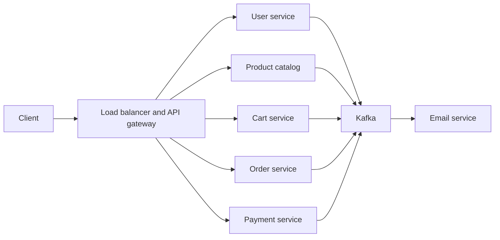
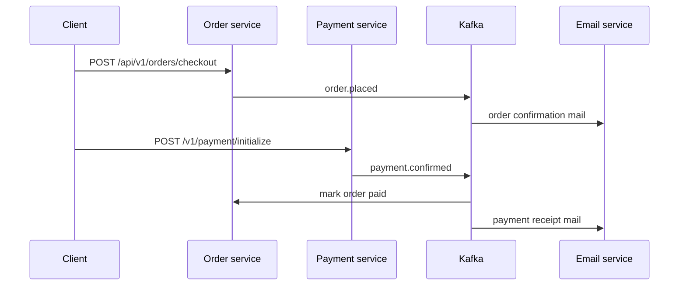

# Academy Project Report

## Nxtlvl Ecommerce Platform

A microservices-based online retail system for user accounts, product discovery, cart, checkout, payment, and email notification.

Submitted in partial fulfillment of the requirements for the Master’s degree.

| | |
|---|---|
| Full name of the student | Sumit Pal |
| Registered Scaler email ID | palsumeeth@gmail.com |
| Month of submission | September 2026 |
| Date of submission | 30/09/2026 |
| Project module | 01/09/2026 to 24/09/2026 |
| Date | 30 September 2026 |
| Project | Nxt-Sumit-ECommerce-App |

---

## Certificate

This is to certify that the project titled **Nxtlvl Ecommerce Platform**, submitted by **Sumit Pal** (Scaler email: palsumeeth@gmail.com), is a record of the design and implementation work carried out for the Master’s program. The project module ran from **01/09/2026** to **24/09/2026**. This report is submitted in **September 2026**, on **27/09/2026**.

The work covers a product requirements document, a high-level design, and a Spring Boot microservices implementation for registration, login, profile management, password reset, product catalog and search, cart, checkout, payment, and notification.

The technical description in this report was checked against the source in `app/microservices` and against `PRD_ HLD of Ecommerce Website.docx.md`. Where the running code differs from the original design, the difference is stated in Chapter 8.

**Date:** 30 September 2026

---

## Declaration

I, **Sumit Pal** (palsumeeth@gmail.com), declare that this project report describes the Nxtlvl Ecommerce Platform developed during the project module from 01/09/2026 to 24/09/2026, and submitted on 27/09/2026. The requirements and architecture sections follow the project PRD and high-level design. The implementation, testing, and deployment sections describe the services as they exist in the codebase on 30 September 2026. Sources used for background reading are listed in the References. This report does not copy another student's project.

**Date:** 30 September 2026  
**Place of submission:** Scaler Master’s project submission

---

## Acknowledgement

I would like to express my heartfelt gratitude to my family for their constant support, patience, and encouragement throughout this journey. Their belief in me kept me motivated during challenging times. I am deeply thankful to the Scaler instructors and mentors for their exceptional guidance, practical insights, and dedication to teaching, which played a crucial role in shaping my understanding and skills. I also extend my appreciation to all those who, in one way or another, inspired, supported, and motivated me to stay committed and successfully complete this program and earn my Master’s degree.

The same teaching made the structure of this project possible. The module, from 1 September 2026 to 24 September 2026, asked for a store that could be split into services with a written specification before the code. That is why Nxtlvl has a product requirements document, a high-level design, and separate services for users, catalog, cart, orders, payments, and email. I am grateful for the practice of comparing that design with the running system, including the places where PostgreSQL stands in for MySQL and Gmail SMTP stands in for Amazon SES.

I also thank the maintainers of the open-source tools used to build the platform: Spring Boot, Spring Data, Spring Security, Apache Kafka, PostgreSQL, MongoDB, Redis, Elasticsearch, and the Stripe and Razorpay client libraries.

**Date:** 30 September 2026

---

## Abstract

Nxtlvl is an ecommerce platform for browsing clothing and related products, maintaining a user account, holding a cart, placing an order, paying for that order, and receiving email about registration, order placement, and payment. A single monolithic application would couple these workflows and force the whole store to be deployed together. This project therefore splits the store into services that own their own data and communicate with HTTP for commands and Apache Kafka for events.

The product requirements document asks for registration and social login, profile management, password reset, category browsing, product detail, keyword search, cart review, checkout, order history and tracking, more than one payment method, secure sessions, and email notification. The high-level design places a load balancer and an API gateway in front of the services, uses Kafka as the event bus, Redis for the cart, Elasticsearch for product search, and a relational database for structured records.

The implementation delivers seven runtime components: service discovery, user management, product catalog, cart, order, payment, and email notification. User, catalog, order, payment, and notification data are stored in PostgreSQL. The cart is stored in MongoDB, with Redis available to the cart service. Product search is indexed in Elasticsearch, while PostgreSQL remains the source of truth for price and product state. Users authenticate with email and password or with Google. Sessions use a short-lived JWT access token and a stored refresh token. Password reset links are emailed as Kafka events and the stored secret is an HMAC hash, not the raw token. Payments can be started through Stripe or Razorpay. Confirmed payments are published on Kafka so the order service and the email service can react.

The report records two deliberate differences from the written design. Relational storage is PostgreSQL rather than MySQL, chosen for concurrency and extensibility. Notification delivery uses Gmail SMTP rather than Amazon SES. An AWS elastic load balancer and a Kong API gateway are specified in the design and are not yet deployed. Service discovery is present as a Eureka server, and the business services do not yet register with it.

**Keywords:** ecommerce, microservices, Spring Boot, Kafka, PostgreSQL, MongoDB, Redis, Elasticsearch, JWT, password reset, Stripe, Razorpay

---

## Table of contents

1. Introduction
2. Literature review
3. Requirements
4. System design
5. Implementation
6. Testing
7. Deployment
8. Results and discussion
9. Conclusion and future scope
10. References
11. Appendix A. API catalogue
12. Appendix B. Ports, databases, and topics
13. Appendix C. Email service container configuration

---

## List of figures

**Figure 1.** Request path from the client through the designed edge (load balancer and API gateway) into a microservice.  
**Figure 2.** Service map: user, catalog, cart, order, payment, and email, with PostgreSQL, MongoDB, Redis, Elasticsearch, and Kafka.  
**Figure 3.** Checkout sequence: cart, order placement, payment confirmation, order status update, and email.



*Figure 2. Implemented services and the Kafka bus. The load balancer and API gateway are in the design. They are not deployed in the current repository.*



*Figure 3. Order and payment event flow.*

---

## List of tables

**Table 1.** PRD capability and where it is implemented.  
**Table 2.** Service responsibilities, ports, and data stores.  
**Table 3.** Kafka topics and consumers.  
**Table 4.** Design choice versus the choice in code.  
**Table 5.** HTTP API catalogue.  
**Table 6.** Database names created for local PostgreSQL.

---

## List of abbreviations

| Abbreviation | Meaning |
|---|---|
| API | Application programming interface |
| DTO | Data transfer object |
| ELB | Elastic Load Balancing |
| HMAC | Hash-based message authentication code |
| HLD | High-level design |
| HTTP | Hypertext Transfer Protocol |
| JPA | Jakarta Persistence API |
| JWT | JSON Web Token |
| PRD | Product requirements document |
| REST | Representational State Transfer |
| SES | Simple Email Service |
| SMTP | Simple Mail Transfer Protocol |
| SQL | Structured Query Language |
| UUID | Universally unique identifier |

---

# 1. Introduction

## 1.1 Background

An online store has to keep accounts, a product list, a cart, orders, payments, and messages to the customer working at the same time. Those workflows change at different speeds. Product data is read often and written by staff. Cart contents change on every click. Payments must be confirmed by an outside provider. Email can be late without blocking checkout. Putting all of that in one process makes a catalog change a risk to payment, and it makes it hard to scale the part that is actually busy.

Nxtlvl is aimed at shoppers who want designer clothing presented clearly, with straightforward navigation and more than one way to pay and to be notified. The project brief in the design notes calls for a minimal interface, consistent APIs, and a data model that can grow toward a large number of users without pretending that day-one infrastructure is already a million-user deployment.

## 1.2 Problem statement

The problem is to build an ecommerce backend that satisfies the functional requirements in the PRD, follows the service boundaries in the high-level design, and keeps each service's data separate. The system must let a person register, sign in, reset a password, browse and search products, change a cart, check out, pay, see order history, and receive email when those events happen. It must do this without sharing one database among all services and without sending email inside the request that places the order.

## 1.3 Objectives

1. Record the store's behaviour in a product requirements document covering users, catalog, cart, orders, payment, and authentication.
2. Describe a high-level design with separate services, a message broker, a cache, and a search index.
3. Implement user registration, password login, Google login, refresh and logout, profile read and update, and password reset.
4. Implement product and category management, product detail, category browse, and keyword search.
5. Implement cart add, review, update, and remove.
6. Implement checkout, order lookup, order history, and order status update.
7. Implement payment start and payment receipt, with Stripe and Razorpay as providers.
8. Implement an email consumer for welcome and reset mail, order placement, and payment confirmation.
9. Keep the written design and the code comparable, and state every place they differ.

## 1.4 Scope

The scope of this report is the backend in `app/microservices` and the requirements and design in `PRD_ HLD of Ecommerce Website.docx.md`.

In scope:

- User, product catalog, cart, order, payment, and email services.
- A Eureka service-discovery server.
- Local infrastructure already used by the services: PostgreSQL, MongoDB, Redis, Kafka, and Elasticsearch.
- Security of passwords, refresh tokens, and password-reset tokens.
- Container settings for the email service.

Out of scope for the current code, and therefore described as future work:

- A storefront user interface.
- Amazon Elastic Load Balancing and a Kong API gateway.
- SMS notification.
- A carrier integration that tracks a parcel after it leaves the warehouse.
- Registering every business service with Eureka.

## 1.5 Methodology

The work followed the document order already in the repository. Functional requirements were written first. The high-level design then assigned each requirement to a service and to a data store. Implementation followed those boundaries: each service is its own Maven module, its own Spring Boot process, and its own database or collection. Events that other services must hear about are published to Kafka instead of being handled with a direct call. Where a design note and the code disagree, the report keeps both and explains the reason, rather than rewriting history to make them match.

---

# 2. Literature review

## 2.1 Microservices for retail

Retail systems are a common example of service decomposition because the business capabilities are already named: identity, catalog, cart, order, payment, and notification. Each capability has its own peak load and its own failure mode. A search index being slow should not stop a password reset. A mail provider being down should not roll back a payment that the bank has already accepted. That is the reason the PRD assigns Kafka to registration, cart activity, order placement, and payment confirmation.

## 2.2 Synchronous and asynchronous communication

A command that must return an answer to the shopper stays on HTTP. Login, product fetch, cart read, and checkout response are requests of that kind. A fact that other services may care about later is an event. "User registered", "order placed", and "payment confirmed" are events. The publisher does not wait for the email to be accepted by Gmail. The email service consumes the topic when it can. This matches the PRD statement that Kafka is the central broker and an event record of important actions.

## 2.3 Data ownership

Sharing one database across services recreates a monolith at the data layer. This project gives PostgreSQL databases separate names: `user_db`, `product_catalog`, `order_db`, `payment_db`, and `notification_db`. The cart uses MongoDB database `cart_db` because a cart document is a flexible list of lines. Redis is attached to the cart service for fast in-memory access, which is the role the PRD gives Redis. Elasticsearch holds a derived product index. The product read policy states that PostgreSQL is authoritative for price and product state, and that search results may lag by up to ten seconds.

## 2.4 Identity and token storage

Passwords are not stored in clear text. The user service encodes them with BCrypt. Session continuity uses a JWT access token with a configured lifetime of 900 seconds and a refresh token with a configured lifetime of 604800 seconds. The refresh token and the password-reset token are stored as HMAC-SHA256 hashes. The raw reset token exists only in the email link. After a successful reset, every reset row for that user is deleted, so the table being empty after a completed reset is expected.

## 2.5 Search and identifiers

The design notes prefer 64-bit numeric identifiers inside the catalog because they are compact to index. Public APIs that expose those numbers can be enumerated, so the same notes recommend a public representation such as a UUID mapping, Hashids, or encryption when the API is exposed to untrusted clients. The current catalog APIs still use numeric ids. That is an accepted gap, recorded in future scope.

## 2.6 Research gap addressed by this project

Textbook designs often stop at a diagram that includes a gateway, a broker, and six databases. This project goes one step further: the services, topics, ports, and persistence choices are implemented and can be compared line by line with the PRD. The gap this report fills is that comparison, including the places where PostgreSQL replaced MySQL and Gmail SMTP replaced Amazon SES.

---

# 3. Requirements

## 3.1 Functional requirements

The functional requirements below are taken from the PRD. Table 1 shows how each one is met.

### 3.1.1 User management

- Registration with email, and registration through a social profile.
- Login with credentials.
- View and update profile details.
- Password reset through a secure link.

### 3.1.2 Product catalog

- Browse products by category.
- Open a product page's data: identity, description, and related fields.
- Search by keyword.

### 3.1.3 Cart and checkout

- Add a product to the cart.
- Review lines with price, quantity, and totals.
- Check out, including the information required to place the order.

### 3.1.4 Order management

- Confirmation after purchase, including order details.
- History of past orders.
- A way to move an order through delivery status.

### 3.1.5 Payment

- More than one payment method.
- A path that can be verified with provider signatures.
- A receipt after a successful payment.

### 3.1.6 Authentication

- Private handling of credentials at login and during the session.
- A session that lasts for a configured time and that the user can end by logging out.

**Table 1. PRD capability and implementation**

| PRD item | Implementation |
|---|---|
| 1.1 Registration by email | `POST /user-mgmt/api/v1/users` |
| 1.1 Social profile | `POST /user-mgmt/api/v1/auth/login/google` creates or resolves the user from Google identity |
| 1.2 Login | `POST /user-mgmt/api/v1/auth/login/password` |
| 1.3 Profile | `GET` and `PUT /user-mgmt/api/v1/profile/me` |
| 1.4 Password reset | `POST /user-mgmt/api/v1/password/reset` and `/confirm` |
| 2.1 Browse by category | `GET /product-catalog/products/category/{categoryId}` and `GET /product-catalog/categories` |
| 2.2 Product details | `GET /product-catalog/products/{id}` |
| 2.3 Keyword search | `GET /product-catalog/products/search` against Elasticsearch |
| 3.1 Add to cart | `POST /api/v1/cart/items` |
| 3.2 Cart review | `GET /api/v1/cart/{userId}` |
| 3.3 Checkout | `POST /api/v1/orders/checkout` |
| 4.1 Order confirmation | Order response plus `order.placed` email |
| 4.2 Order history | `GET /api/v1/orders?userId=` |
| 4.3 Tracking | `PATCH /api/v1/orders/{orderId}/status` updates status. No carrier tracking API is integrated |
| 5.1 Multiple payment options | Stripe and Razorpay payment links |
| 5.2 Secure transactions | Webhook signature checks for Stripe and Razorpay |
| 5.3 Receipt | `GET /v1/payment/receipt/{orderId}` and `payment.confirmed` email |
| 6.1 Secure authentication | BCrypt password hashes, JWT, hashed refresh tokens |
| 6.2 Session management | Access token 900 seconds, refresh token 7 days, `POST /api/v1/auth/logout` revokes refresh tokens |

## 3.2 Non-functional requirements

These come from the design notes and the high-level design.

- **Independent deployment.** Each service has its own port and its own build.
- **Asynchronous notification.** Mail is triggered by Kafka, not by a blocking call inside checkout.
- **Search performance.** Product keyword search uses Elasticsearch. The catalog database remains the authority for price and state.
- **Cart speed.** Cart storage is document-oriented, with Redis configured for the cart service.
- **Security of secrets.** Password-reset and refresh values are hashed before they are written. Mail and database passwords come from environment variables.
- **Operability.** Hibernate can update relational schemas in development. SQL logging is enabled on the services that use JPA. A Postman collection exists for the main flows.
- **Room to scale.** The design notes say to start small, measure, and add capacity, rather than provisioning for a million concurrent users on the first deployment.

## 3.3 Users of the system

- **Shopper.** Registers, signs in, searches, manages a cart, checks out, pays, and reads mail.
- **Catalog operator.** Creates categories and products through the catalog write APIs.
- **Order operator.** Moves an order to a new status.
- **Payment provider.** Stripe or Razorpay calls the webhook after the shopper pays.

## 3.4 Assumptions

- The shopper or a test client can call each service directly until an API gateway is added.
- Local infrastructure is already running: PostgreSQL on port 5432, Kafka on port 9092, MongoDB on port 27017, Redis on port 6379, and Elasticsearch on port 9200.
- Email delivery in development uses an SMTP password supplied as `MAIL_PASSWORD`.
- An unknown email on password reset returns success without creating a token, so the API does not reveal whether the account exists.

## 3.5 Limitations

- There is no storefront in this repository.
- Kong and AWS ELB are specified and not implemented.
- Eureka runs, but the other services do not register with it.
- Order tracking is a status field, not a logistics feed.
- Notification is email only. SMS from the PRD is not implemented.
- The email Dockerfile still documents port 8090, while the process listens on 9008. The Compose file was updated to publish 9008.
- Business services are not all on the same Spring Boot generation. Most use 3.5.7. Payment uses 3.3.5. Email and service discovery use 3.3.2.

---

# 4. System design

## 4.1 Architectural components

The high-level design lists these components:

1. Load balancers, specified as Amazon Elastic Load Balancing.
2. An API gateway, specified as Kong, for routing, rate limits, and authentication.
3. Microservices for user, catalog, cart, order, payment, and notification.
4. Relational storage for structured data and a document store for flexible data.
5. Kafka as the message broker.
6. Redis as the cache, mainly for the cart.
7. Elasticsearch for product search.

Figure 2 shows how the implemented services sit on that bus. In the current repository the client calls a service port directly. The load balancer and Kong remain design components.

## 4.2 Service design

**Table 2. Services, ports, and stores**

| Service | Port | Context path | Store | PRD role |
|---|---|---|---|---|
| Service discovery | 9001 | none | none | Not named in the PRD. Added so services can be found later |
| User management | 9002 | `/user-mgmt` | PostgreSQL `user_db` | Registration, login, profile, password reset, Kafka events |
| Product catalog | 9004 | `/product-catalog` | PostgreSQL `product_catalog`, Elasticsearch | Listings, categories, search |
| Cart | 9005 | none | MongoDB `cart_db`, Redis | Cart lines and fast access |
| Order | 9006 | none | PostgreSQL `order_db` | Checkout, history, status, Kafka |
| Payment | 9007 | none | PostgreSQL `payment_db` | Stripe and Razorpay, receipts, Kafka |
| Email / notification | 9008 | none | PostgreSQL `notification_db` | Consumes Kafka and sends mail |

There is no service on port 9003.

## 4.3 User service design

The user service owns `users`, `user_identities`, `user_metadata`, `refresh_token`, and `password_reset_token`.

Registration checks that the email is not already present, stores a BCrypt password hash, publishes a registration event and a welcome email, and returns an access token and a refresh token. Google login verifies the Google token, then finds or creates the user and the external identity. Password login loads the user by email and checks the password. Refresh rotates the refresh token. Logout revokes active refresh tokens for that user.

Password reset looks up the email. If the user exists, it creates a random token, stores only the HMAC hash with a one-hour expiry, and publishes the raw token on the `emailservice` topic. Confirm hashes the token from the link, rejects a missing, unknown, used, or expired token, updates the password, and deletes reset rows for that user.

Profile read and update apply to the authenticated user. Security permits registration, login, and password routes without a bearer token. Other routes require authentication. A `local` profile can permit all requests for development.

## 4.4 Catalog design

Categories and products are relational. Search and listing reads may use the Elasticsearch index. The product read policy v1.0 fixes the rules:

- The database is the authority for product state and price.
- Elasticsearch is a derived, eventually consistent read model.
- Search can be up to about ten seconds behind the database.
- Checkout must re-check price and state in the database.
- Products are not hard-deleted immediately. They change state.
- Only an `ACTIVE` product with stock can be purchased.
- If search is down, search endpoints return HTTP 503.

## 4.5 Cart design

A cart is a document in MongoDB keyed so that a user's lines can be added, listed, updated, and removed. Redis is configured on the cart service for the fast read path described in the PRD. Cart changes are in a position to be published to Kafka, which is the "add to cart" event in the design's typical flow.

## 4.6 Order and payment design

Checkout creates an order and publishes `order.placed`. Payment initialization creates a provider payment link through Stripe or Razorpay and stores the payment. When the provider calls `/webhook/stripe` or `/webhook/razorpay`, the signature is checked. A confirmed payment is published as `payment.confirmed`. The order service consumes that topic and can update the order. The email service consumes the same topic and sends a receipt. The shopper can also fetch the receipt by order id.

## 4.7 Notification design

The PRD notification service consumes events and sends them through a third-party mail platform. The implementation consumes three topics:

**Table 3. Kafka topics**

| Topic | Publisher | Consumers |
|---|---|---|
| `user.registered` | User service | Available for downstream offers. Welcome mail is also sent by the user service onto `emailservice` |
| `emailservice` | User service | Email service group `signup` |
| `order.placed` | Order service | Email service group `email-service-orders` |
| `payment.confirmed` | Payment service | Order service group `order-service`, email service group `email-service-payments` |

The email service stores a notification log in `notification_db` and sends mail with JavaMail over Gmail SMTP on port 587 with STARTTLS.

## 4.8 Data design

`app/microservices/postgres/init-databases.sql` creates:

**Table 6. PostgreSQL databases**

| Database | Used by |
|---|---|
| `user_db` | User service |
| `user_auth_db` | Reserved beside the user database. The running user service connects to `user_db` |
| `product_catalog` | Product catalog service |
| `cart_db` | Named for a relational cart. The cart service uses MongoDB database `cart_db` instead |
| `order_db` | Order service |
| `payment_db` | Payment service |
| `notification_db` | Email service |

User tables include `users`, `user_identities`, `user_metadata`, `refresh_token`, and `password_reset_token`. The reset table columns are `id`, `user_id`, `token_hash`, `expires_at`, and `used`.

## 4.9 Security design

- Passwords: BCrypt.
- Access tokens: JWT, HMAC-SHA256, 900-second lifetime, secret from `JWT_SECRET`.
- Refresh tokens: random token stored as an HMAC hash, 7-day lifetime, revocable.
- Password reset: 73-character-class random token stored as an HMAC hash, 1-hour lifetime, single use, then deleted.
- Reset requests for an unknown email do not create a row and still return HTTP 202.
- Payment webhooks fail closed when the signature does not match.
- CSRF protection on the user service is disabled because clients send bearer tokens rather than cookie session forms. This is acceptable only while the browser client is not using cookie authentication.

## 4.10 Typical shopper flow

1. The shopper registers or signs in. The user service returns tokens and publishes a welcome message when the account is new.
2. The shopper searches. The catalog service queries Elasticsearch. Price checks later use PostgreSQL.
3. The shopper adds a product. The cart service stores the line in MongoDB.
4. The shopper checks out. The order service stores the order and publishes `order.placed`. The email service sends the confirmation.
5. The shopper pays through Stripe or Razorpay. The webhook publishes `payment.confirmed`. The order service updates the order. The email service sends the receipt.
6. The shopper can list past orders and can sign out, which revokes refresh tokens.

---

# 5. Implementation

## 5.1 Technology stack

- Language: Java 17.
- Framework: Spring Boot 3.5.7 for user, catalog, cart, and order. Spring Boot 3.3.5 for payment. Spring Boot 3.3.2 for email and service discovery.
- Relational access: Spring Data JPA and PostgreSQL.
- Cart access: Spring Data MongoDB and Spring Data Redis.
- Search: Spring Data Elasticsearch.
- Messaging: Spring Kafka.
- User security: Spring Security, Auth0 java-jwt 4.4.0, Bouncy Castle, Google API client and Google auth library.
- Payments: stripe-java 26.12.0 and razorpay-java 1.4.7.
- Mail: JavaMail 1.5.5.
- Build: Maven, one module per service.
- Discovery server: Spring Cloud Netflix Eureka.

## 5.2 Module layout

```text
app/microservices/
  service-discovery/
  user-service/
  product-catalog-service/
  cart-service/
  order-service/
  payment-service/
  email-service/
  postgres/init-databases.sql
  postman/NXT-Ecommerce.postman_collection.json
```

Each business service follows the same internal shape: `controller`, `service`, `repo` or repository, `entity` or document, and `dto`. User security, token hashing, and OAuth verification live under `user-service`. Payment provider clients live under `payment-service`.

## 5.3 User implementation notes

`PasswordResetService.requestReset` returns immediately when the email is unknown, so no token is written. When the user exists, it saves `PasswordResetToken` and then asks `EmailSender` to publish the link. `confirmReset` updates `password_hash` and then calls `deleteByUserId`, which removes the row. A completed reset therefore leaves `password_reset_token` empty. That behaviour was confirmed against `user_db`: reset mail for an existing user was present on the `emailservice` topic, and the table had no row after confirm.

`TokenHashService` uses HMAC-SHA256 and Base64. The same helper hashes refresh tokens.

## 5.4 Catalog implementation notes

Write APIs create categories and products. Read APIs fetch one product, list by category, and search. The read policy document is the contract that order creation must use the database price, not the search index price.

## 5.5 Cart, order, and payment implementation notes

Cart endpoints add a line, fetch the cart by user id, update a line, and delete a line. Order endpoints check out, fetch one order, list history by user id, and patch status. Payment endpoints initialize a payment and fetch a receipt. Webhooks are separate from the shopper API so provider servers can call them without a shopper JWT.

## 5.6 Email implementation notes

`EmailConsumer` listens on `emailservice`, `order.placed`, and `payment.confirmed`. Order and payment handlers skip the message when it has no email address. `EmailService` writes a notification attempt and sends through a Gmail session. The SMTP user is the message `from` address, and the SMTP password is `nxt.mail.password`.

## 5.7 Configuration

Services read secrets from the environment and fall back to local defaults:

- `POSTGRES_USER` and `POSTGRES_PASSWORD`, default `postgres`.
- `KAFKA_BOOTSTRAP_SERVERS`, default `localhost:9092`.
- `JWT_SECRET` and `TOKEN_HASH_SECRET` on the user service.
- `MAIL_PASSWORD` on the email service.
- `MONGODB_URI`, `REDIS_HOST`, and `REDIS_PORT` on the cart service.

These defaults are for a developer machine. They are not production secrets.

## 5.8 API style

The design notes require consistent names, stateless calls, and clear errors. Implemented routes use `/api/v1` on user, cart, and order. Catalog uses `/products` and `/categories` under the context path. Payment uses `/v1/payment` and `/webhook`. Validation errors return a field map with HTTP 400. Duplicate registration returns HTTP 409. A missing reset token returns a dedicated exception. This is consistent inside each service and not yet identical across all services.

---

# 6. Testing

## 6.1 Approach

Testing is automated at the service level with JUnit and Spring Boot test support, plus a Postman collection for the flows a client would call. The database tests that should not need PostgreSQL use H2 in PostgreSQL compatibility mode. Kafka listeners are kept from starting in those tests.

## 6.2 Automated coverage present in the repository

- **User service.** `PasswordResetServiceTest` checks that a known user causes a token save and an email send, that an unknown user causes neither, and that confirm rejects a blank token, an unknown token, and an expired token. `PasswordResetControllerTest` checks validation and that the controller calls the service.
- **Product catalog.** `ProductServiceTest` covers catalog service behaviour. Catalog persistence tests use H2.
- **Email service.** `EmailServiceTest`, `EmailConsumerTest`, and `EmailServiceApplicationTests` cover the mail path. Email tests use H2 and disable Kafka listener auto-start.
- **Payment service.** Payment tests use H2 and disable Kafka listener auto-start.

## 6.3 Manual checks already performed

- PostgreSQL `user_db` contains the user tables, including `password_reset_token` with columns `token_hash`, `expires_at`, `used`, and `user_id`.
- The `emailservice` topic contained welcome and password-reset messages, which shows the user service reached the publish step.
- After a completed reset, the token table was empty because confirm deletes rows for that user.
- Docker on the development machine was running PostgreSQL, Kafka, MongoDB, Redis, and Elasticsearch, which are the processes the services expect.

## 6.4 Test limitations

The service README still lists unfinished unit tests and a SonarQube quality pass as open tasks. This report does not claim a coverage percentage, because no coverage report is stored in the repository. End-to-end checkout through a real Stripe or Razorpay account was not re-run for this document. Webhook tests require provider secrets and signed payloads.

## 6.5 Suggested regression checks

1. Register a new email and confirm a row in `users` and a welcome message on `emailservice`.
2. Log in with the password and call `GET /user-mgmt/api/v1/profile/me` with the access token.
3. Request a reset, confirm a `password_reset_token` row exists before confirm, then confirm the reset and confirm the row is gone and the new password works.
4. Create a category and a product, search, and add the product to the cart.
5. Check out, initialize payment in a test provider mode, and confirm an `order.placed` or `payment.confirmed` mail is logged.

---

# 7. Deployment

## 7.1 Local processes

The development layout runs infrastructure in Docker and the Spring Boot services on the host:

| Process | Host port |
|---|---|
| Eureka | 9001 |
| User service | 9002 |
| Product catalog | 9004 |
| Cart service | 9005 |
| Order service | 9006 |
| Payment service | 9007 |
| Email service | 9008 |
| PostgreSQL | 5432 |
| MongoDB | 27017 |
| Redis | 6379 |
| Kafka | 9092 |
| Elasticsearch | 9200 |

## 7.2 Email service Compose file

`app/microservices/email-service/docker-compose.yml` is the only Compose file in the microservices tree. It defines two services:

- `nxt-email-service`, built from the email Dockerfile, published on **9008**, with `SPRING_DATASOURCE_URL` set to `jdbc:postgresql://postgres-db:5432/notification_db`, database user `postgres`, `KAFKA_BOOTSTRAP_SERVERS` set to `host.docker.internal:9092`, and `MAIL_PASSWORD` taken from the environment.
- `postgres-db`, image `postgres:15`, container name `email-postgres`, database `notification_db`, with a health check. The email service waits until that check passes. Postgres is not published on host port 5432, so it does not collide with the existing PostgreSQL container.

The Compose file used to publish port 8090 and create a database named `email_db` with different credentials. That did not match `application.properties`. It has been updated to the values above.

## 7.3 What is not deployed

- Kong API gateway.
- AWS Elastic Load Balancing.
- A single Compose file that starts every business service.
- Kubernetes or any other orchestrator.
- Amazon SES.

## 7.4 Runtime configuration for mail

Set `MAIL_PASSWORD` before starting the email container if the Gmail account requires an application password. If the variable is omitted, the service falls back to the development default stored in `application.properties`.

---

# 8. Results and discussion

## 8.1 What the project achieves

The repository contains a PRD, a high-level design, and a working split of the store into services. A shopper path can be executed with HTTP: register, log in, reset a password, manage a profile, create and search products, change a cart, place an order, start a payment, and receive mail from Kafka events. Each relational service has its own database name. Tokens that must not be stored in clear text are hashed.

## 8.2 Design compared with the code

**Table 4. Design choice versus code**

| Topic | PRD or HLD | Implementation | Reason |
|---|---|---|---|
| Relational database | MySQL | PostgreSQL | Design notes choose PostgreSQL for concurrency, extensibility, and behaviour under load |
| Mail provider | Amazon SES | Gmail SMTP on port 587 | JavaMail session is implemented. SES is not integrated |
| Cart database | MongoDB and Redis | MongoDB configured, Redis configured | Matches the PRD |
| Product search | Elasticsearch | Spring Data Elasticsearch, with PostgreSQL as the authority | Matches the product read policy |
| Edge | ELB and Kong | Direct service ports | Not built yet |
| Service finding | Not in the PRD | Eureka server on 9001, services not registered | Discovery is prepared, not wired |
| Extra database | Not named | `user_auth_db` is created by SQL and unused by the current datasource URL | The user service uses `user_db` |
| Notification channels | Email and possibly SMS | Email only | SMS is future work |
| Order tracking | Delivery status for the shopper | Status patch on the order | No shipping carrier |

## 8.3 Password reset result

The reset flow meets requirement 1.4. The link is random, the database stores a hash, the link expires, and a successful confirm both changes the password and removes the token. Observers who look only at `password_reset_token` after confirm will see no row. That is the cleanup step, not a failed insert. Observers who request a reset for an email that is not in `users` will also see no row, and the HTTP status is still 202, which is intentional.

## 8.4 Risks in the current build

- Calling services directly means every client must know every port. A gateway would hide that.
- Local default secrets are in property files. A shared environment must override `JWT_SECRET`, `TOKEN_HASH_SECRET`, database passwords, and mail passwords.
- Spring Boot versions differ across modules, so dependency patches have to be applied more than once.
- The email image metadata still exposes 8090 even though the server port is 9008.
- Catalog numeric ids are still the public identifiers.

---

# 9. Conclusion and future scope

## 9.1 Conclusion

Nxtlvl demonstrates an ecommerce backend whose boundaries follow the PRD: identity, catalog, cart, order, payment, and notification. Kafka carries registration mail, order placement, and payment confirmation. PostgreSQL, MongoDB, Redis, and Elasticsearch are used in the roles the design describes, with PostgreSQL standing in for the MySQL named in the original HLD. Authentication covers password login, Google login, refresh, logout, and a hashed password-reset token. Payments can start on Stripe or Razorpay and can be confirmed only when the webhook signature matches.

The project, submitted by Sumit Pal on 30 September 2026 for the Scaler Master’s program, is a complete implementation of the specified service split. It is not a complete production storefront. The edge (load balancer and Kong), SMS, carrier tracking, and a unified public API shape are still open.

## 9.2 Future scope

1. Add a Kong route table that exposes one host and forwards to ports 9002 through 9008.
2. Register every service with Eureka and let the gateway resolve instances.
3. Replace Gmail SMTP with Amazon SES, as the PRD specifies, and keep the Kafka consumers unchanged.
4. Add SMS on the same notification log.
5. Re-check product price and `ACTIVE` state inside order checkout against the catalog database, as the read policy requires.
6. Publish a public product id that is not a raw sequential number.
7. Add a storefront that uses the Postman flows.
8. Align every module on one Spring Boot version.
9. Finish the remaining unit tests and run SonarQube, which are already listed as repository tasks.
10. Add a carrier status feed behind `PATCH /api/v1/orders/{orderId}/status` so tracking is more than an internal status word.
11. Correct the email Dockerfile `EXPOSE` from 8090 to 9008 so the image metadata matches the process.

## 9.3 Closing statement

The value of the project is that the requirements, the design, and the code can be read together. A reviewer can take any PRD sentence, find the service and the route, and see the topic or the table that makes that sentence true. The differences are written down instead of being hidden.

---

# 10. References

1. Project product requirements and high-level design: `PRD_ HLD of Ecommerce Website.docx.md` in this repository.
2. Project design notes: `docs/NXT Core Fundamentals & System Design Overview.md`.
3. Product read policy: `app/microservices/product-catalog-service/docs/ProductReadPolicy-v1.0.md`.
4. Spring Boot reference documentation, versions 3.3 and 3.5. https://docs.spring.io/spring-boot/
5. Spring for Apache Kafka reference. https://docs.spring.io/spring-kafka/reference/
6. PostgreSQL documentation, version 15. https://www.postgresql.org/docs/15/
7. MongoDB manual. https://www.mongodb.com/docs/manual/
8. Redis documentation. https://redis.io/docs/latest/
9. Elasticsearch reference. https://www.elastic.co/guide/en/elasticsearch/reference/current/index.html
10. RFC 7519, JSON Web Token. https://www.rfc-editor.org/rfc/rfc7519
11. Stripe API reference, payment links and webhooks. https://docs.stripe.com/
12. Razorpay payment-link and webhook documentation. https://razorpay.com/docs/
13. Netflix Eureka. https://github.com/Netflix/eureka
14. Kong gateway documentation, cited as the designed API gateway, not as a deployed component. https://docs.konghq.com/
15. Amazon SES documentation, cited as the designed mail provider, not as the implemented provider. https://docs.aws.amazon.com/ses/
16. Kleppmann, M. *Designing Data-Intensive Applications*. O'Reilly. Cited in the project design notes for identifier and scalability trade-offs.

---

# Appendix A. API catalogue

**Table 5. HTTP APIs**

| Method | Path | Service port | Purpose |
|---|---|---|---|
| POST | `/user-mgmt/api/v1/users` | 9002 | Register |
| POST | `/user-mgmt/api/v1/auth/login/password` | 9002 | Password login |
| POST | `/user-mgmt/api/v1/auth/login/google` | 9002 | Google login |
| POST | `/user-mgmt/api/v1/auth/refresh` | 9002 | Refresh tokens |
| POST | `/user-mgmt/api/v1/auth/logout` | 9002 | Revoke refresh tokens |
| GET | `/user-mgmt/api/v1/profile/me` | 9002 | Read profile |
| PUT | `/user-mgmt/api/v1/profile/me` | 9002 | Update profile |
| POST | `/user-mgmt/api/v1/password/reset` | 9002 | Request reset mail |
| POST | `/user-mgmt/api/v1/password/confirm` | 9002 | Set a new password |
| POST | `/product-catalog/categories` | 9004 | Create category |
| GET | `/product-catalog/categories` | 9004 | List categories |
| POST | `/product-catalog/products` | 9004 | Create product |
| GET | `/product-catalog/products/{id}` | 9004 | Product detail |
| GET | `/product-catalog/products/category/{categoryId}` | 9004 | Browse by category |
| GET | `/product-catalog/products/search` | 9004 | Keyword search |
| POST | `/api/v1/cart/items` | 9005 | Add cart line |
| GET | `/api/v1/cart/{userId}` | 9005 | Review cart |
| PUT | `/api/v1/cart/items/{itemId}` | 9005 | Update line |
| DELETE | `/api/v1/cart/items/{itemId}` | 9005 | Remove line |
| POST | `/api/v1/orders/checkout` | 9006 | Place order |
| GET | `/api/v1/orders/{orderId}` | 9006 | Get order |
| GET | `/api/v1/orders?userId=` | 9006 | Order history |
| PATCH | `/api/v1/orders/{orderId}/status` | 9006 | Update status |
| POST | `/v1/payment/initialize` | 9007 | Start payment |
| GET | `/v1/payment/receipt/{orderId}` | 9007 | Receipt |
| POST | `/webhook/stripe` | 9007 | Stripe webhook |
| POST | `/webhook/razorpay` | 9007 | Razorpay webhook |
| GET | `/notifications` | 9008 | List notification log |

---

# Appendix B. Ports, databases, and topics

| Item | Value |
|---|---|
| User datasource | `jdbc:postgresql://localhost:5432/user_db` |
| Catalog datasource | `jdbc:postgresql://localhost:5432/product_catalog` |
| Order datasource | `jdbc:postgresql://localhost:5432/order_db` |
| Payment datasource | `jdbc:postgresql://localhost:5432/payment_db` |
| Email datasource | `jdbc:postgresql://localhost:5432/notification_db` |
| Cart MongoDB | `mongodb://localhost:27017/cart_db` |
| Redis | `localhost:6379` |
| Kafka | `localhost:9092` |
| Access token lifetime | 900 seconds |
| Refresh token lifetime | 604800 seconds |
| Reset token lifetime | 3600 seconds |
| SMTP | `smtp.gmail.com:587` |

---

# Appendix C. Email service container configuration

File: `app/microservices/email-service/docker-compose.yml`

- Service `nxt-email-service` publishes `9008:9008`.
- Datasource URL inside the container is `jdbc:postgresql://postgres-db:5432/notification_db`.
- Database user and password match the application defaults: `postgres` / `postgres`.
- Kafka bootstrap is `host.docker.internal:9092` so the container uses the broker on the host.
- `MAIL_PASSWORD` is passed through from the shell environment.
- Postgres container name is `email-postgres`. It creates `notification_db` and is not bound to host port 5432.
- The email service starts after the Postgres health check succeeds.

This appendix records the Compose file after it was aligned with `email-service` `application.properties`.
